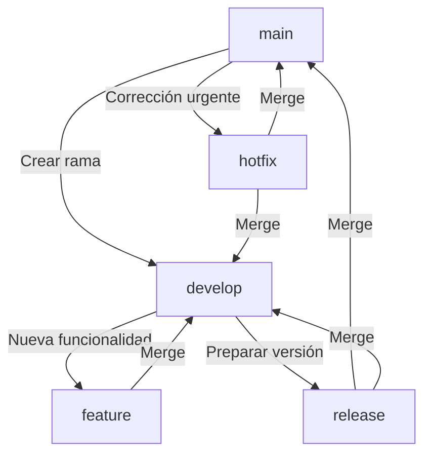
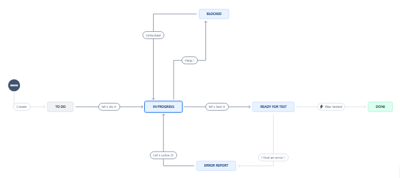

# SORCOL: Aprende Lengua de Señas Colombiana con Nosotros


Bienvenido a **SORCOL**, una plataforma web interactiva diseñada para enseñar la **Lengua de Señas Colombiana** (LSC). Nuestro objetivo es ofrecer un espacio accesible y amigable donde cualquier persona pueda aprender LSC a través de niveles estructurados. Cada nivel está compuesto por:

- **5 unidades** por nivel.
- **5 lecciones** en cada unidad.
- **10 actividades** por lección, diseñadas para desarrollar habilidades lingüísticas en LSC.

Los usuarios podrán explorar algunos contenidos iniciales sin necesidad de registrarse. A partir de cierto punto, se les invitará a crear una cuenta para continuar con su progreso.

---

## Tecnologías Utilizadas

### **Frontend**
- [React](https://reactjs.org/): Para desarrollar la interfaz de usuario interactiva.
- [Supabase](https://supabase.com/): Para la autenticación de usuarios y almacenamiento de datos.

### **Backend**
- [Supabase](https://app.supabase.com/): Base de datos PostgreSQL con API RESTful para gestionar los datos.

### **Herramientas adicionales**
- [Cloudflare](https://www.cloudflare.com/): Gestión de DNS y seguridad web.
- [Netlify](https://www.netlify.com/): Despliegue y alojamiento del sitio web.
- [Resend](https://resend.com/): Servicio de envío de correos electrónicos.

Nuestro sitio web está disponible en: [wearesorcol.com](https://wearesorcol.com)

---

## Instalación y Configuración

### 1. Clonar el Repositorio

Recomendamos clonar el repositorio utilizando **SSH** por razones de seguridad:

```bash
git clone git@github.com:Sorcol-App/web.git
```

### 2. Configuración del Entorno

Dentro del directorio del proyecto, crea un archivo .env.local con las variables de entorno necesarias. Estas variables son sensibles y deberán solicitarse al equipo para garantizar una correcta conexión al sistema.

### 3. Instalación de Dependencias
Asegúrate de tener instalada una versión reciente de Node.js. Luego, instala las dependencias ejecutando:

```bash
npm install
```

### 4. Ejecutar en Modo Desarrollo

Para iniciar la aplicación en modo desarrollo, usa:

```bash
npm run dev
```
Esto abrirá el proyecto en: http://localhost:3000.

---

## Flujo de Trabajo 

El flujo de trabajo del proyecto se gestionará de forma paralela utilizando Git para el control de versiones y Jira para la administración de tareas e incidencias. A continuación, se describe cómo funcionará cada flujo:

### 1. Flujo de Trabajo en Git
Se seguirá un modelo de desarrollo basado en Git Flow, como se muestra en el diagrama.



### Flujo de Trabajo de Tareas en Jira
En Jira, las tareas se gestionarán según el diagrama, lo que permite un seguimiento claro del estado de cada incidencia desde la creación hasta su finalización.



Para más información y documentación detallada del proyecto, visita:  
[docs.wearesorcol.com](https://docs.wearesorcol.com)

---

## Prototipos

Hemos desarrollado **prototipos de alta fidelidad** con Figma para asegurar una experiencia de usuario óptima. Estos prototipos nos ayudan a visualizar la interfaz y el flujo de trabajo antes del desarrollo.

Accede a los prototipos interactivos en el siguiente enlace:

[ Ingresa a Figma](“https://www.figma.com/design/lbgyDGM2PJF580cGRg8kRU/”)

**También podrás visualizar:**
- Diseño de la página principal.  
- Flujos de registro e inicio de sesión.  
- Pantallas de perfil y actualización de datos.  
- Interfaces de gestión de contenido.

---
## Conclusión

**SORCOL** busca reducir la brecha de comunicación entre la comunidad oyente y la comunidad sorda en Colombia. Con esta plataforma, aspiramos a que más personas puedan aprender la Lengua de Señas Colombiana de manera interactiva y accesible.

Para más información y documentación detallada del proyecto, visita:  
[docs.wearesorcol.com](https://docs.wearesorcol.com)

**¡Únete a nosotros y sé parte de este cambio positivo!**